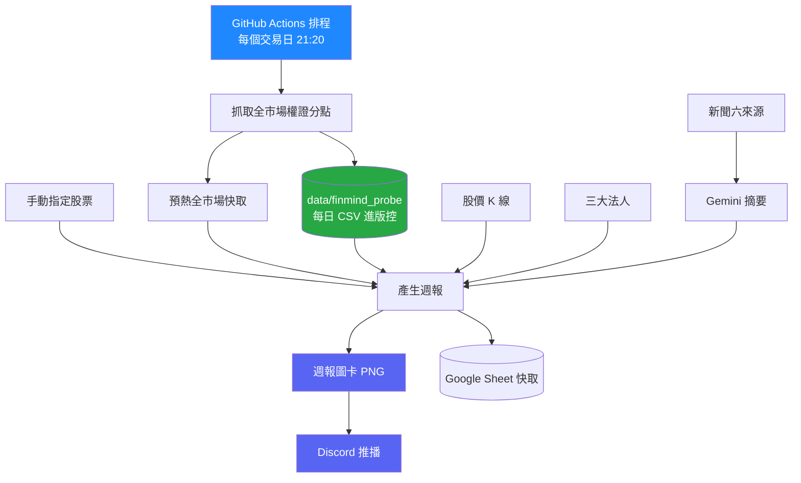

<div align="center">

# 📊 權證分點籌碼分析系統

**追蹤台股權證的分點進出，找出誰在買、誰在賣、買了多少。**

自動抓取全市場權證分點資料，整理成週報圖卡，透過 Discord 推播。

<br>


[](https://github.com/M1229012/warrants/actions/workflows/generate_warrant_report.yml)
[](https://github.com/M1229012/warrants/actions/workflows/test_finmind-warrant-probe.yml)

</div>

---

## 這個專案在做什麼

權證的籌碼分佈藏在「分點」資料裡 —— 哪一家券商的哪一個分行買了多少、賣了多少。
這些資料每天散落在各處，單獨看沒有意義，累積起來才看得出誰在持續佈局。

本專案把這件事自動化：

```
每個交易日盤後  →  抓全市場權證分點  →  比對標的股、法人、新聞
                                      →  產生週報圖卡  →  推播到 Discord
```

<!-- 想放成果圖的話，把圖片丟到 docs/ 底下，然後取消下面這行的註解

-->

---

## ✨ 功能

| | |
| --- | --- |
| 📈 **分點買賣超** | 逐檔權證的分點進出，含買賣張數與金額 |
| 🏦 **標的股統計** | 權證對應正股，彙整同一標的的所有權證動向 |
| 🗓️ **排名與明細** | 近一個月分點排名、近 10 個交易日逐日明細 |
| 🔍 **精選分點追蹤** | 指定分點的資金流向，支援自訂分點清單 |
| 📰 **新聞整合** | 六來源聚合後由 Gemini 摘要，附在週報上 |
| 🖼️ **圖卡推播** | 產出 2400px 圖卡，自動送進 Discord |
| ⚙️ **全自動** | GitHub Actions 排程，盤後自己跑完 |

---

## 🔄 系統流程



---

## 📁 專案結構

```text
warrants/
├── 主程式/          週報主流程
├── 回測/            策略與績效驗證
├── 分點工具/         分點資料抓取與維護
├── Discord/         圖卡推播與 Bot
├── data/            抓下來的資料（進版控）
└── .github/workflows/
```

<details>
<summary><b>展開完整結構</b></summary>

```text
warrants/
├── 主程式/
│   ├── K_function_warrant_report_20260530.py   單一股票權證週報
│   ├── run_report.py                           報告產生入口
│   └── warrant_sources.py                      替代資料來源（Yahoo／MoneyDJ）
│
├── 回測/
│   ├── warrant_backtest.py                     權證分點回測
│   ├── warrant_backtest_moneydj.py             權證分點回測（MoneyDJ 來源）
│   └── stock_branch_backtest.py                現股分點回測
│
├── 分點工具/
│   ├── finmind_warrant_probe.py                每日權證分點抓取
│   └── warrant_broker_ma_history.py            分點均線歷史
│
├── Discord/
│   ├── discord_warrant_report_gsheet.py        圖卡產生與推播
│   ├── public_preview_masked.py                公開預覽版（遮罩分點名稱）
│   └── cloudflare_worker/                      Discord Bot 指令（Node.js）
│
├── data/finmind_probe/
│   ├── complete/                               每日全市場權證分點 CSV
│   └── states/                                 每日抓取狀態
│
├── mops_warrant_identity_seed.csv.gz           發行商識別種子檔
├── requirements.txt
└── README.md
```

> 資料夾用中文、程式檔名維持英文。
> 工作流一律**從 repo 根目錄執行**（`python 主程式/run_report.py`），
> 所以程式裡的相對路徑不受影響。`run_report.py` 會 import 主程式，兩者必須同層。

</details>

---

## 🚀 快速開始

需要 Python 3.11。

```bash
git clone https://github.com/M1229012/warrants.git
cd warrants

python -m venv venv
source venv/bin/activate        # Windows 用 venv\Scripts\activate
pip install -r requirements.txt
```

執行（**從 repo 根目錄**，不要 `cd` 進子資料夾）：

```bash
python 主程式/run_report.py                      # 產生權證週報
python 分點工具/finmind_warrant_probe.py           # 抓當日權證分點
python Discord/discord_warrant_report_gsheet.py  # 產生 Discord 圖卡
python 回測/warrant_backtest.py                   # 權證分點回測
```

---

## 🗃️ 資料來源

| 資料 | 主要來源 | 備援 |
| --- | --- | --- |
| 權證分點日報 | FinMind | MoneyDJ |
| 個股 K 線 | FinMind | Yahoo Finance |
| 權證清單 | 證交所 OpenAPI | — |
| 三大法人 | FinMind | 證交所／櫃買 |
| 新聞 | Google News · Yahoo · Bing · MoneyDJ · MOPS · FinMind | 六來源互為備援 |

備援來源在 `主程式/warrant_sources.py`，可以單獨執行做來源對照：

```bash
python 主程式/warrant_sources.py price   2330 6488   # 股價對照
python 主程式/warrant_sources.py warrant 03882T      # 權證分點對照
```

<details>
<summary><b>⚠️ 資料保存的時效限制（維運必讀）</b></summary>

<br>

**MoneyDJ 的權證分點只保留約兩週的滾動視窗。** 實測 `2026/07/28` 有資料、`2026/07/15` 已無。

所以 FinMind 一旦停用，**兩週以前的權證分點歷史就永久拿不回來**。

目前唯一的長期保存是 `data/finmind_probe/complete/` 裡逐日 commit 的 CSV，
由 `分點工具/finmind_warrant_probe.py` 產生。**這份資料請勿刪除。**

另外，**GitHub Actions cache 不是保存空間** —— 超過 7 天沒被存取就清除，
每個 repo 上限 10 GB、超過後 LRU 淘汰。需要長期保留的請寫進 `data/`。

**來源對照結果**（趁 FinMind 仍可用時驗證）：

- 收盤價：109 個交易日與 FinMind 完全相同
- 權證分點：分點清單與買賣股數完全一致
- 成交量：Yahoo 比 FinMind 少 3.5%～15%（收錄範圍差異，非單位問題），
  使用量能型態分析時要留意

</details>

---

## 🤖 自動化流程

| Workflow | 用途 |
| --- | --- |
| `generate_warrant_report.yml` | 權證週報產圖 ＋ 每日盤後預熱全市場快取 |
| `test_finmind-warrant-probe.yml` | 抓每日權證分點，寫進 `data/` |
| `discord_warrant_report.yml` | Discord 圖卡推播 |
| `discord_warrant_public_preview.yml` | 公開預覽版圖卡 |
| `register_discord_commands.yml` | 註冊 Discord Bot 指令 |
| `warrant_backtest.yml` | 權證分點回測 |
| `warrant_backtest_MONEYDJ_NEW.yml` | 權證分點回測（MoneyDJ） |
| `stock_branch_backtest.yml` | 現股分點回測 |
| `warrant_broker_ma_history.yml` | 分點均線歷史 |

---

## ⚙️ 設定

<details>
<summary><b>環境變數</b></summary>

<br>

本機用 `.env`，GitHub Actions 用 Secrets。

```env
FINMIND_API_TOKEN=

GOOGLE_SHEET_NAME=權證分點籌碼
GOOGLE_SHEET_ID=
GCP_SERVICE_KEY=

WARRANT_GSHEET_ENABLE=1
WARRANT_GSHEET_CACHE_ENABLE=1
WARRANT_CACHE_FORCE_REFRESH=0
WARRANT_ALWAYS_REFRESH_WARRANT_FLOW=0

DISCORD_WEBHOOK_URL=
DISCORD_BOT_TOKEN=
DISCORD_APPLICATION_ID=
DISCORD_GUILD_ID=
```

</details>

<details>
<summary><b>GitHub Secrets</b></summary>

<br>

Repository Settings → Secrets and variables → Actions：

```text
FINMIND_API_0714
GCP_SERVICE_KEY
DISCORD_WEBHOOK_URL
DISCORD_WEBHOOK_URL_TEST
DISCORD_BOT_TOKEN
DISCORD_APPLICATION_ID
DISCORD_GUILD_ID
WARRANTS_API_KEY
```

</details>

<details>
<summary><b>快取機制</b></summary>

<br>

快取用來避免每次重抓全部資料：

- 權證分點資料快取
- 權證價格快取
- 標的股價格快取
- 股票名稱對照快取
- 近 10 日分點買賣明細快取
- Google Sheet 快取工作表

資料異常或快取污染時，設定 `WARRANT_CACHE_FORCE_REFRESH=1` 重新整理。

</details>

<details>
<summary><b>開發注意事項</b></summary>

<br>

**不要上傳到 GitHub：** `.env`、Google Service Account JSON、Discord Token／Webhook、任何 API 金鑰。

**修改程式時：**

- 不要更改 Google Sheet 工作表名稱與既有欄位順序
- 不要破壞快取格式
- 五分點模式與全分點模式資料需分開確認
- 近一個月與近 10 日資料應以交易日為主
- 搬動 `.py` 檔案時，記得同步改 `.github/workflows/` 裡的路徑
- **不要改 `data/` 資料夾名稱**，程式裡寫死了 `data/finmind_probe`

</details>

---

## 📌 License

私人研究與自動化分析用途。未經授權請勿轉載、販售或公開使用。

本專案輸出的所有數據為公開資料的整理與估算，**不構成投資建議**。

<div align="center">
<sub>資料來源：臺灣證券交易所 · 證券櫃檯買賣中心 · FinMind · MoneyDJ · Yahoo Finance</sub>
</div>
